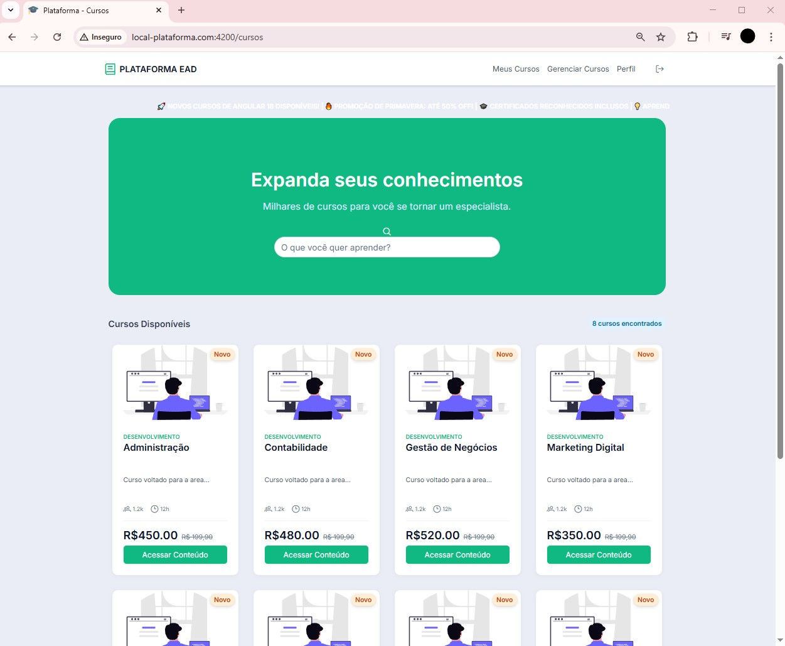
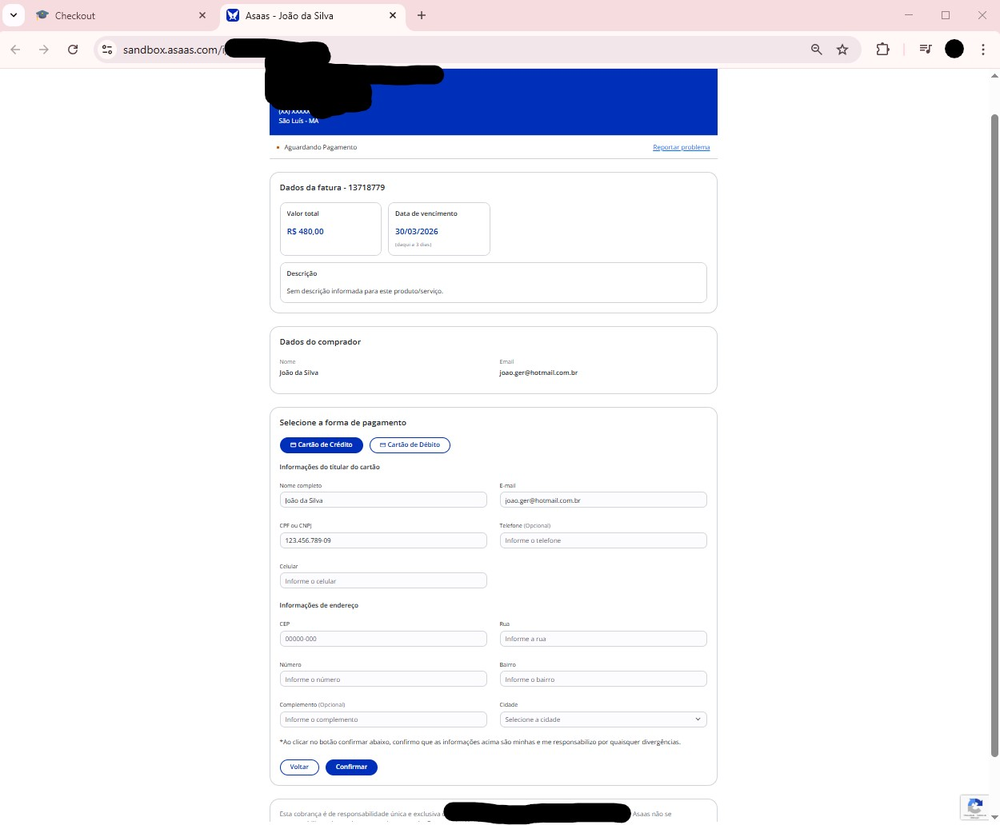
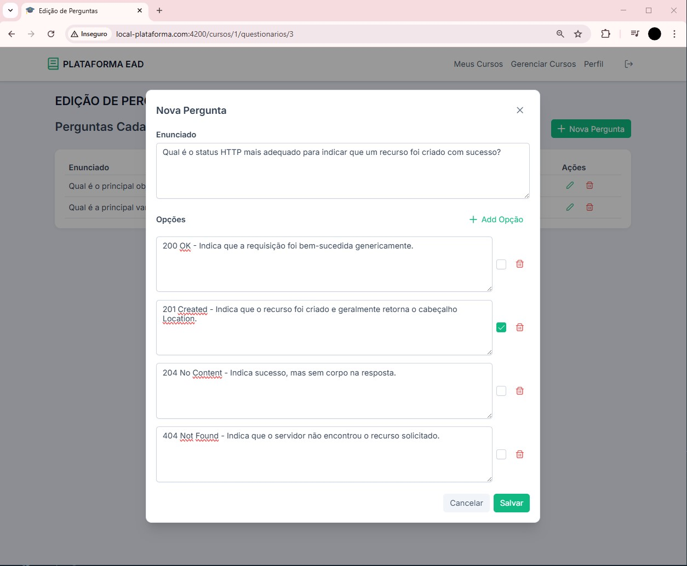
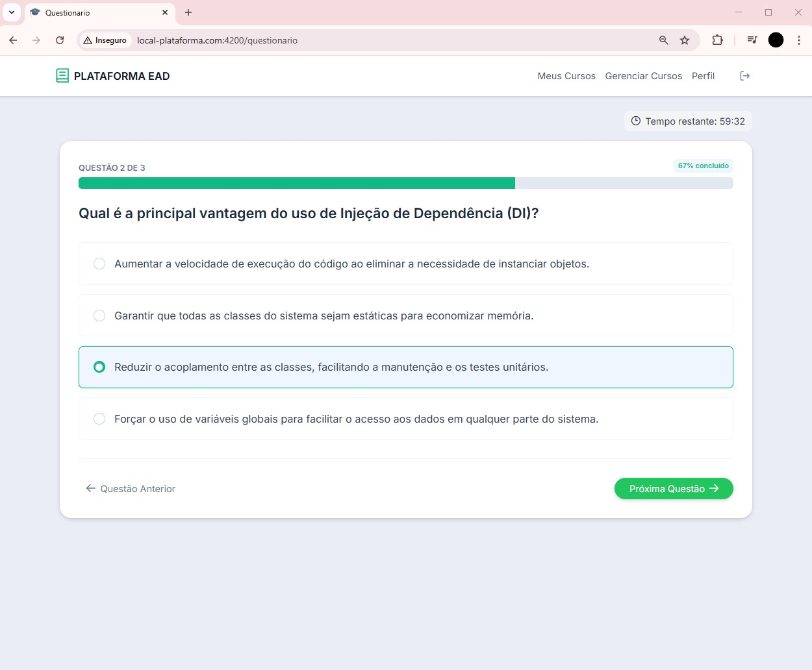
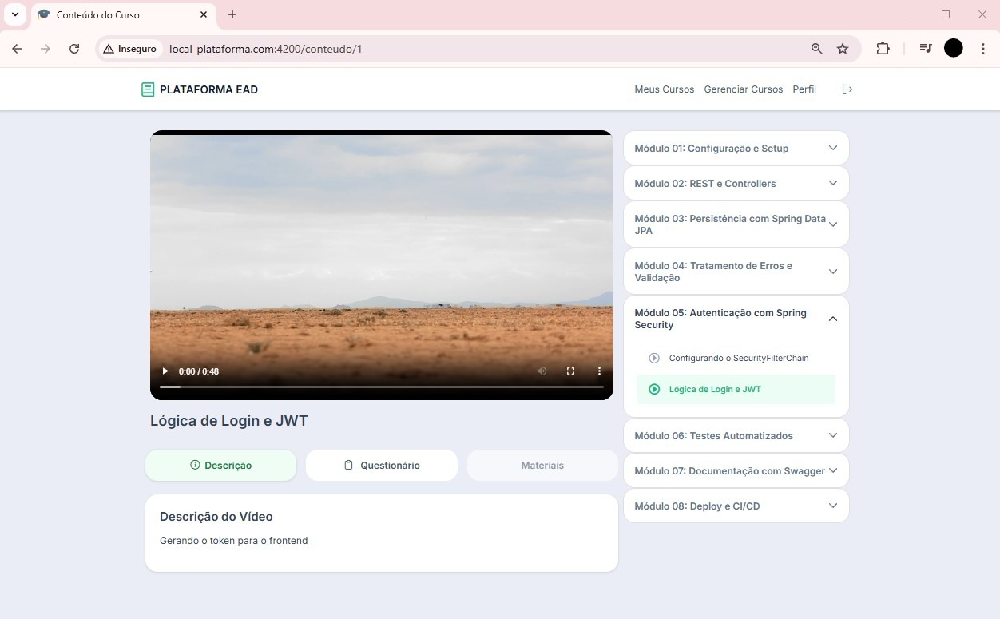

# 🎓 Plataforma EAD Full Stack - Front-end


Uma solução de ensino à distância que integra gestão de conteúdo, sistema de pagamentos em tempo real e segurança de nível empresarial. Este front-end foi construído para oferecer uma experiência fluida e reativa tanto para o aluno quanto para o administrador.

## 🌟 Diferenciais Técnicos
- **Estrutura de Dados em Árvore:** Algoritmo para gerenciar a hierarquia de Módulos e Aulas, garantindo renderização recursiva e eficiente no Player.
- **Angular 21 & Signals:** Gerenciamento de estado reativo e ultra-performante.
- **Segurança Avançada:** Implementação de **OAuth2** com um provedor **OpenID Connect customizado**.
- **Integração Real de Pagamento:** Fluxo completo de checkout com a API do **Asaas** e Webhooks.
- **Gestão de Mídia & Storage:** Persistência de vídeos via **Cloudinary** e fotos de perfil via **Amazon S3**.

---

## 🚀 Funcionalidades Principais

### 🧑‍🎓 Experiência do Aluno
* **Catálogo de Cursos:** Listagem dinâmica com busca otimizada via Signals.
* **Fluxo de Checkout Real:** Integração com Asaas (Cartão). O curso é liberado automaticamente após a confirmação do pagamento via Webhook no Back-end.
* **Ambiente de Aula:** Player de vídeo com troca automática de aulas, organização por módulos (Accordion) e progresso em tempo real.
* **Certificação:** Questionários com **cronômetro**. A aprovação depende do alcance da média mínima da instituição.
* **Gestão de Conta:** Edição de perfil (nome, foto via AmazonS3, senha) e recuperação de senha via e-mail com código temporário (5 min).

### 👨‍🏫 Área Administrativa (Professor/Gerente)
* **Gestão de Conteúdo:** CRUD completo de cursos, módulos e lições.
* **Upload Inteligente:** Envio de vídeos para o Cloudinary com retorno do link persistido no banco.
* **Controle de Status:** Ativação/Inativação de cursos em tempo real.
* **Construtor de Provas:** Criação de questionários vinculados aos cursos com definição de chaves de resposta.
* **Segurança Granular:** Acesso protegido por **Route Guards** e **Role-Based Access Control (RBAC)**.

---

## 🔗 Integração com o Back-end
Este projeto consome uma API RESTful desenvolvida em Java/Spring Boot.
* **Repositório Back-end:** https://github.com/JuniorLicassali/plataforma-ead
* **Arquitetura:** Comunicação assíncrona baseada em Promises e Observables (RxJS).

---

## ⚙️ Como Rodar o Projeto

### 1. Pré-requisitos
* Node.js v20+
* Angular CLI v21
* Arquivo de hosts configurado (para OAuth2 local)

### 2. Configuração de Host (Essencial)
Como o projeto utiliza um provedor OpenID Connect customizado, é necessário mapear o domínio local no seu Sistema Operacional.

**Windows (Executar Bloco de Notas como Admin):**
Arquivo: `C:\Windows\System32\drivers\etc\hosts`
Adicione: `127.0.0.1 local-plataforma.com`

**Linux/Mac (Terminal):**
`sudo nano /etc/hosts`
Adicione: `127.0.0.1 local-plataforma.com`

### 3. Instalação e Execução
```bash
# Instalar dependências
npm install

# Rodar o projeto apontando para o host customizado
ng serve --host local-plataforma.com
```

---

## 📸 Demonstração Visual (Algumas rotas)

<div align="center">
  
  
  <br>
  
  
  
  <br>
  
</div>

---

# Autor

Emanoel F. Licassali

https://www.linkedin.com/in/emanoel-licassali-793604228